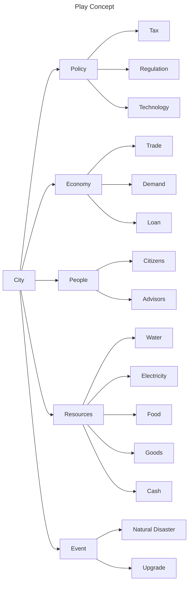

# Concept




## Policy

The policy section of the game mechanics includes research and push regulation and stuff.

So we will have tech tree and each tech tree can have an interface with

```typescript
interface Technology {
    name: string
    done: boolean
    progress: number
    next: Array<Technology>
    last: Technology | undefined
}

interface TechTree {
    get: (name:string) => Technology | undefined
}
```

This interface can let user know if the tech is done or not\
The technology research will unlock game mechanics as time pass

When the goverment and economy unlock to the certain level, the bank and tax policy will shows up

## Economy

## People

Each person in the game is a individual living being, The major (Player) cannot directly control to it.

People needs food and watch to survive, To the certain satisfaction level, it will go reproduce

## Resources

* Food
* Watch
* Goods
* Electricity
* Cash
* etc...

At the begining, The cash field will have gold bar symbol, This means there is no money yet.

## Event